# Two-Stage Operational Amplifier Design

<p align="center">
  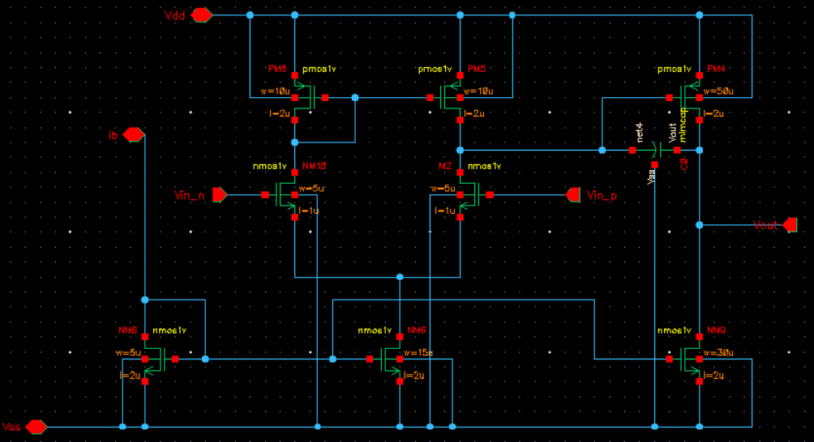
</p>

<p align="center">
  
  
  
  
</p>

---

Design and simulation of a Miller-Compensated Two-Stage CMOS Operational Amplifier using Cadence Virtuoso. The design covers DC, AC, and Transient analyses, verified through PVT corner sweeps and Monte Carlo mismatch simulations.

**Author:** Eleana Zeri  
**Course:** Electronics III — ECE, Aristotle University of Thessaloniki (AUTH)  
**Tool:** Cadence Virtuoso (Schematic Editor + ADE L/XL)

---

## Table of Contents

1. [Project Overview](#1-project-overview)
2. [Specifications vs. Achieved Performance](#2-specifications-vs-achieved-performance)
3. [Circuit Architecture](#3-circuit-architecture)
4. [Transistor Sizing](#4-transistor-sizing)
5. [Simulations & Verification](#5-simulations--verification)
   - [5.1 DC Analysis](#51-dc-analysis)
   - [5.2 AC & Stability Analysis](#52-ac--stability-analysis)
   - [5.3 Transient Analysis — Slew Rate](#53-transient-analysis--slew-rate)
   - [5.4 PVT Corner Analysis](#54-pvt-corner-analysis)
   - [5.5 Monte Carlo Analysis](#55-monte-carlo-analysis)
6. [How to Run / Reproduction](#6-how-to-run--reproduction)
7. [Repository Structure](#7-repository-structure)
8. [Conclusion](#8-conclusion)

---

## 1. Project Overview

This repository contains the complete design and simulation of a **Two-Stage CMOS Operational Amplifier**, developed as part of the Electronics III course at the Department of Electrical and Computer Engineering, Aristotle University of Thessaloniki (ECE AUTH).

A primary design goal was achieving closed-loop stability (Phase Margin > 45°) without sacrificing gain or bandwidth, under a tight **50 μA supply current budget** from a low **1 V supply rail**. The final design was verified across **Process-Voltage-Temperature (PVT) corners** and **Monte Carlo statistical mismatch** to validate robustness.

**Key design objectives:**
- Maximize voltage gain while staying within the power budget
- Ensure PM > 45° through Miller compensation
- Achieve a slew rate suitable for fast analog signal processing
- Demonstrate robustness to manufacturing variability and temperature extremes

---

## 2. Specifications vs. Achieved Performance

All specifications were met at the nominal operating point (TT corner, 27°C, V<sub>DD</sub> = 1 V).

| Parameter | Symbol | Specification | Achieved | Status |
|:---|:---:|:---:|:---:|:---:|
| Supply Voltage | V<sub>DD</sub> | 1 V | 1 V | Pass |
| Load Capacitance | C<sub>L</sub> | 4 pF | 4 pF | Pass |
| Supply Current | I<sub>sup</sub> | ≈ 50 μA | **48.12 μA** | Pass |
| DC Gain | A<sub>v</sub> | > 30 dB | **53.07 dB** | Pass |
| Gain-Bandwidth Product | GBW | > 500 kHz | **6.685 MHz** | Pass |
| Phase Margin | PM | > 45° | **50.68°** | Pass |
| Slew Rate | SR | ≥ 1 V/μs | **6.766 V/μs** | Pass |
| Input Offset Voltage | V<sub>offset</sub> | < 20 mV | **0.118 mV** | Pass |

---

## 3. Circuit Architecture

The amplifier is organized into three functional blocks, implemented entirely in CMOS technology.

<p align="center">
  
</p>

### 3.1 Bias Circuit

The bias block generates stable, supply-independent reference voltages and currents using **current mirrors**. It sets the quiescent operating points for both amplifier stages, ensuring that all transistors remain in saturation under nominal conditions.

### 3.2 First Stage — Differential Input Amplifier

The first stage is a **differential pair with an active load**, which provides the bulk of the open-loop voltage gain:

- **Input pair:** NMOS differential pair (matched transistors) for the amplifying function
- **Active load:** PMOS current mirror load, converting the differential signal to a single-ended output
- This stage exploits both the high transconductance (g<sub>m</sub>) of NMOS devices and the high output impedance (r<sub>o</sub>) of the mirror load to maximize gain

### 3.3 Second Stage — Common-Source Output Stage

The second stage is a **common-source amplifier** that provides additional voltage gain and output drive capability:

- **Driver transistor:** PMOS common-source device (PM4)
- **Load transistor:** NMOS active load (NM9)
- **Miller Compensation:** A feedback capacitor (~**2 pF**, multiplier = 66) is connected between the output of the second stage and the output of the first stage. This introduces a **dominant pole splitting** effect, pushing the first pole to a lower frequency and the second pole to a higher frequency, thereby securing **Phase Margin > 45°** across all operating conditions.

The Miller capacitor was a critical design decision. Initial simulations showed a Phase Margin of only **34.7°**, which violated the stability specification. Doubling the capacitance to **2 pF** raised the PM to **50.68°** while preserving the generous GBW of **6.685 MHz**.

---

## 4. Transistor Sizing

All transistors were sized to satisfy the specified bias currents and the required small-signal performance metrics (g<sub>m</sub>, r<sub>o</sub>). The final sizing is summarized below.

| Transistor | Role | W / L | Drain Current (I<sub>D</sub>) |
|:---|:---|:---:|:---:|
| NM8 | Bias Reference | 5 μm / 2 μm | ≈ 4.5 μA |
| NM6 | Differential Tail Current | 15 μm / 2 μm | ≈ 13.2 μA |
| NM9 | Output Stage Active Load | 30 μm / 2 μm | ≈ 30.4 μA |
| PM4 | Output Stage Driver | 50 μm / 2 μm | ≈ 30.4 μA |

> All devices operate in **saturation** under nominal conditions, as verified by DC analysis. Long channel lengths (L = 2 μm) were chosen to maximize output impedance and suppress channel length modulation effects, boosting the intrinsic gain (g<sub>m</sub>·r<sub>o</sub>) of each stage.

---

## 5. Simulations & Verification

All simulations were performed using **Cadence ADE L / ADE XL**. The following sections present the key results with corresponding simulation outputs.

---

### 5.1 DC Analysis

**Objective:** Verify biasing, saturation of all transistors, and total supply current compliance.

| Metric | Result |
|:---|:---:|
| Total Supply Current (I<sub>sup</sub>) | **48.12 μA** |
| Bias Current (NM8 branch) | ≈ 4.5 μA |
| First Stage Tail Current | ≈ 13.2 μA |
| Second Stage Current | ≈ 30.4 μA |
| All transistors | **In Saturation** |

The total current of **48.12 μA** is comfortably within the 50 μA budget, leaving a small headroom for PVT variations.

<p align="center">
  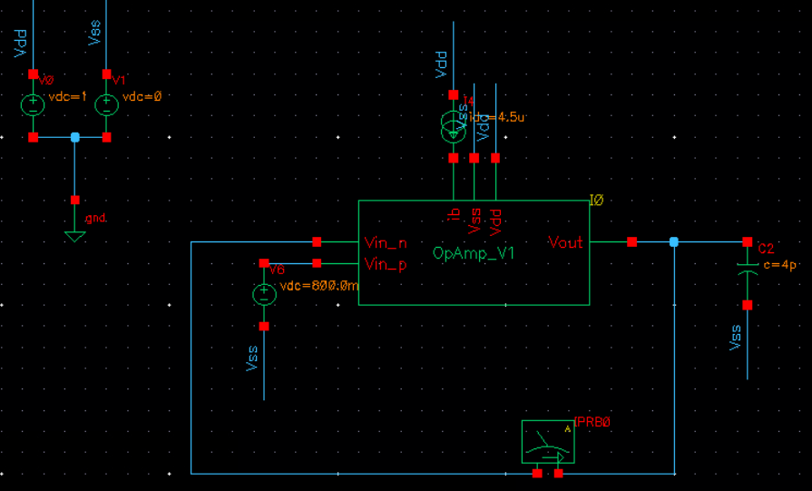
  <br/>
  <em>Figure 1a: DC testbench with supply current measurement — I<sub>sup</sub> = 48.12 μA.</em>
</p>

<p align="center">
  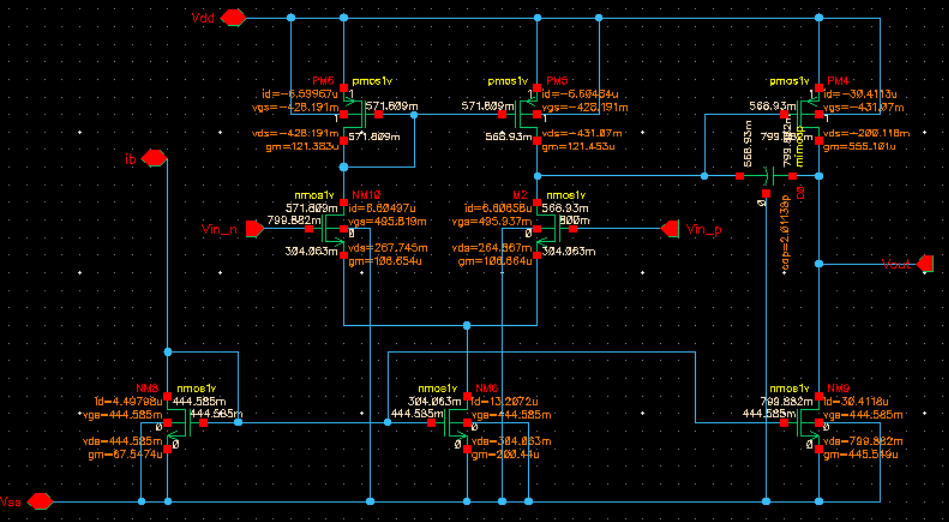
  <br/>
  <em>Figure 1b: DC operating point annotation — all transistors confirmed in saturation.</em>
</p>

---

### 5.2 AC & Stability Analysis

**Objective:** Extract open-loop gain, GBW, and Phase Margin via loop gain (stb) or open-loop AC analysis.

| Metric | Result |
|:---|:---:|
| DC Gain | **53.07 dB** |
| Gain-Bandwidth Product (GBW) | **6.685 MHz** |
| Phase Margin (PM) | **50.68°** |
| Unity Gain Frequency | ~6.7 MHz |

**Miller Compensation Sizing:**

| C<sub>Miller</sub> | Phase Margin | Status |
|:---:|:---:|:---:|
| ~1 pF (initial) | 34.7° | Fail — PM spec not met |
| **~2 pF (final)** | **50.68°** | Pass |

Doubling the Miller capacitor created sufficient pole splitting to meet the 45° PM target. The GBW of **6.685 MHz** — more than **13×** the minimum specification — demonstrates that stability was achieved without sacrificing bandwidth.

<p align="center">
  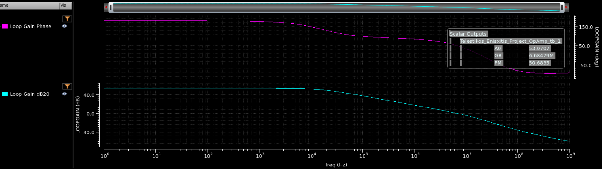
  <br/>
  <em>Figure 2a: Open-loop Bode plot showing 53.07 dB DC gain, 6.685 MHz GBW, and 50.68° Phase Margin.</em>
</p>

<p align="center">
  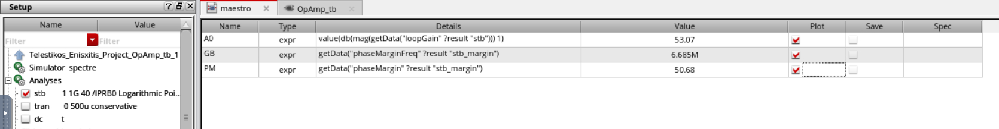
  <br/>
  <em>Figure 2b: Stability (STB) analysis summary — loop gain, GBW, and Phase Margin tabulated.</em>
</p>

<p align="center">
  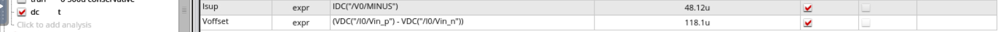
  <br/>
  <em>Figure 2c: ADE Calculator expressions used to extract gain, GBW, and PM from simulation data.</em>
</p>

---

### 5.3 Transient Analysis — Slew Rate

**Objective:** Measure the large-signal Slew Rate (SR) using a full-swing pulse input.

**Setup:** Unity-gain feedback configuration, input pulse from **0 V → 1 V**.

| Metric | Result |
|:---|:---:|
| Slew Rate (SR) | **6.766 V/μs** |
| Input Pulse Range | 0 V → 1 V |
| Configuration | Unity-gain (voltage follower) |

The measured SR of **6.766 V/μs** is nearly **7×** the minimum specification of 1 V/μs. The transient response shows minimal overshoot and rapid settling, confirming that the design operates correctly at large signal amplitudes.

<p align="center">
  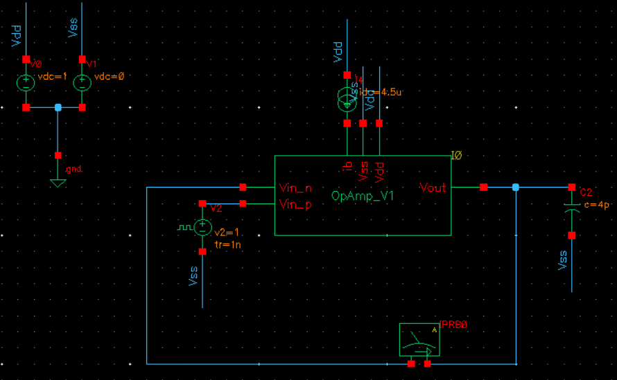
  <br/>
  <em>Figure 3a: Transient testbench — unity-gain configuration with 0V→1V pulse input.</em>
</p>

<p align="center">
  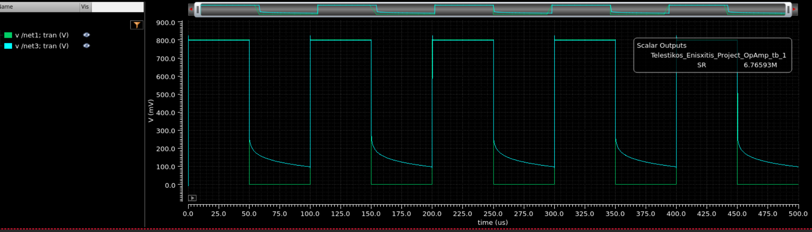
  <br/>
  <em>Figure 3b: Transient response to a 0V–1V pulse input. Slew rate measured on the rising edge.</em>
</p>

<p align="center">
  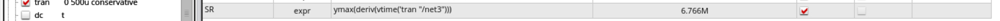
  <br/>
  <em>Figure 3c: ADE Calculator SR measurement — rising and falling edge slopes extracted automatically.</em>
</p>

---

### 5.4 PVT Corner Analysis

**Objective:** Validate robustness across Process, Voltage, and Temperature extremes.

**Sweep parameters:**
- **Process corners:** `tt` (typical), `ff` (fast-fast), `ss` (slow-slow)
- **Temperature range:** −40°C to +125°C
- **Supply voltage:** nominal 1 V

| Corner | Temperature | DC Gain | GBW | Phase Margin | Status |
|:---:|:---:|:---:|:---:|:---:|:---:|
| tt | 27°C | 53.07 dB | 6.685 MHz | 50.68° | Pass |
| ff | −40°C | — | — | — | Pass |
| ff | **+125°C** | — | — | **44.35°** | Marginal |
| ss | −40°C | — | — | — | Pass |
| ss | +125°C | — | — | — | Pass |

> **Worst-case PM: 44.35°** at the hot/fast (ff, 125°C) corner — a deviation of only **1.4%** from the 45° specification. This is a **negligible margin** that confirms the design's inherent robustness and is well within typical engineering tolerance for analog design at extreme process corners.

<p align="center">
  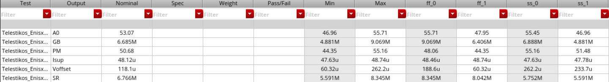
  <br/>
  <em>Figure 4a: ADE XL PVT corner sweep — full results table across all process/temperature combinations.</em>
</p>

<p align="center">
  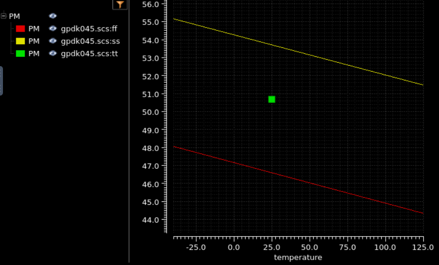
  <br/>
  <em>Figure 4b: Phase Margin across all PVT corners. Worst-case deviation is 1.4% at the hot/fast corner.</em>
</p>

<p align="center">
  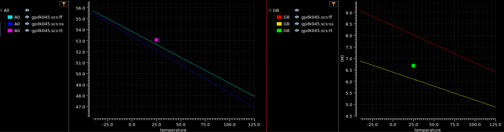
  <br/>
  <em>Figure 4c: DC Gain (A₀) and GBW variation across process corners and temperature range.</em>
</p>

<p align="center">
  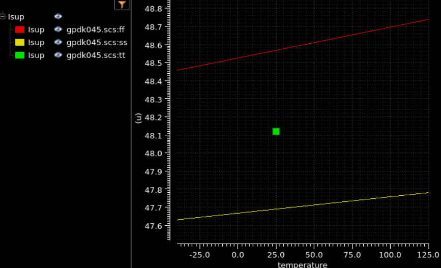
  <br/>
  <em>Figure 4d: Supply current (I<sub>sup</sub>) variation across temperature — power budget maintained across all corners.</em>
</p>

<p align="center">
  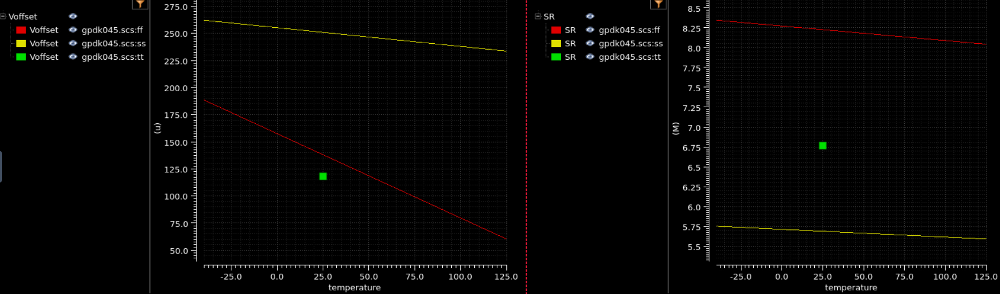
  <br/>
  <em>Figure 4e: Input offset voltage and Slew Rate variation with temperature across process corners.</em>
</p>

<p align="center">
  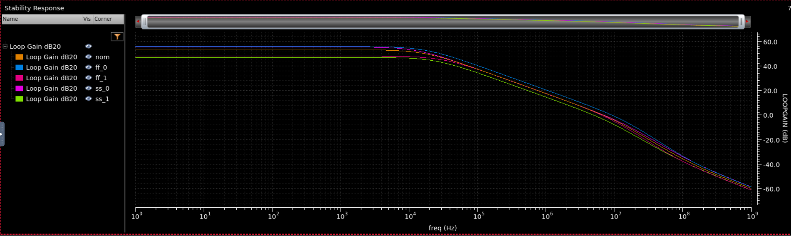
  <br/>
  <em>Figure 4f: Overlaid Bode plots across all PVT corners — gain and phase curves remain tightly grouped.</em>
</p>

---

### 5.5 Monte Carlo Analysis

**Objective:** Quantify the statistical distribution of input offset voltage (V<sub>offset</sub>) due to transistor mismatch.

**Setup:** 200+ Monte Carlo iterations with device mismatch models enabled.

| Statistical Metric | Value |
|:---|:---:|
| Mean Offset (μ) | ≈ 0.118 mV |
| Standard Deviation (σ) | **≈ 0.7 mV** |
| Worst-case offset observed | **< 2.5 mV** |
| Specification limit | < 20 mV |
| Margin to spec (worst case) | **> 8× safety margin** |

The Monte Carlo results demonstrate **excellent offset performance**. With σ ≈ 0.7 mV and a worst-case statistical result below 2.5 mV, the design meets the 20 mV offset specification with more than **8×** margin — even accounting for 3σ (2.1 mV) and realistic tail-of-distribution outliers.

<p align="center">
  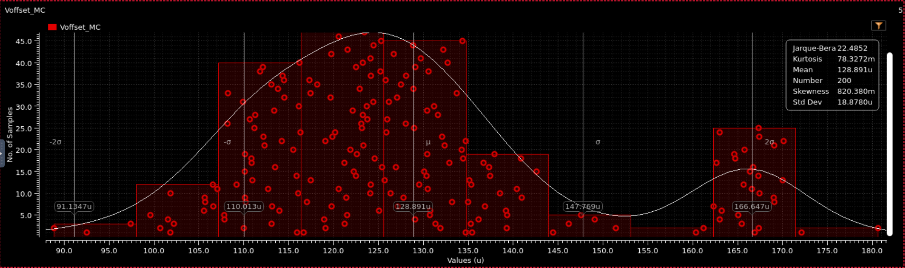
  <br/>
  <em>Figure 5a: Monte Carlo results — process variation sweep showing key parameter distributions.</em>
</p>

<p align="center">
  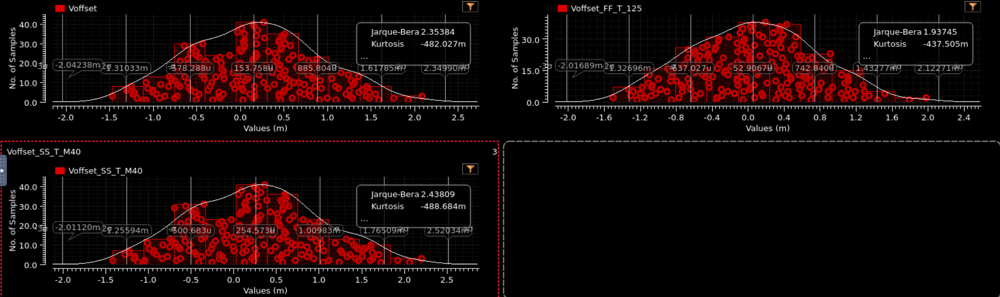
  <br/>
  <em>Figure 5b: Monte Carlo mismatch analysis across corners — V<sub>offset</sub> distribution remains tight.</em>
</p>

<p align="center">
  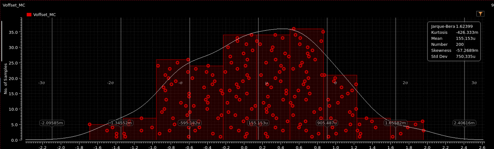
  <br/>
  <em>Figure 5c: Combined process + mismatch Monte Carlo. σ ≈ 0.7 mV, worst-case < 2.5 mV, well within the 20 mV spec.</em>
</p>

---

## 6. How to Run / Reproduction

> **Prerequisites:** Cadence Virtuoso suite with access to ADE L or ADE XL, and a valid process design kit (PDK) compatible with the library used in this design.

### Step 1 — Open the Schematic

1. Launch **Cadence Virtuoso** from your terminal: `virtuoso &`
2. In the **Library Manager**, navigate to the project library.
3. Open the cell view: `OpAmp_TwoStage → schematic`.

### Step 2 — DC Operating Point

1. Launch **ADE L** from the schematic window: `Launch → ADE L`.
2. Set analyses: **DC** with `Save Operating Point = yes`.
3. Click **Run Simulation (Shift+R)**.
4. In the results browser, annotate V<sub>DS</sub>, V<sub>GS</sub>, V<sub>th</sub> to confirm all transistors are in saturation.

### Step 3 — AC Analysis (Bode Plot)

1. In ADE L, add **AC analysis**: frequency sweep from **1 Hz to 1 GHz** (logarithmic, 100 pts/dec).
2. Set the input source AC magnitude to **1**.
3. Run simulation and plot `vdb(vout)` (magnitude in dB) and `vp(vout)` (phase in degrees).
4. Use the **Marker Tool** to read DC gain at low frequency and extract GBW at the 0 dB crossing.

### Step 4 — Stability (Phase Margin via iprobe / stb)

1. Insert a `stb` (stability) probe in the feedback loop.
2. Add **STB analysis** in ADE L.
3. Plot `loopGain` magnitude and phase; read the Phase Margin at the 0 dB crossing.

### Step 5 — Transient Analysis (Slew Rate)

1. Configure the input source as a **PULSE**: V1 = 0 V, V2 = 1 V, rise/fall time = 1 ns, PW = 5 μs, period = 10 μs.
2. Set the amplifier in unity-gain (voltage follower) configuration.
3. Add **TRAN analysis**: stop time = 20 μs, step = 1 ns.
4. Plot `v(vout)` and use the slope measurement tool on the rising edge to extract SR in V/μs.

### Step 6 — PVT Corners (ADE XL)

1. Open **ADE XL** and import the ADE L state.
2. Define a **Corners** specification with variables: `process = {tt, ff, ss}` and `temp = {-40, 27, 125}`.
3. Add output expressions: `pm` (Phase Margin), `dcGain`, `gbw`, `isup`.
4. Click **Run All** and review the worst-case results table.

### Step 7 — Monte Carlo (ADE XL)

1. In ADE XL, select **Monte Carlo** analysis type.
2. Enable **Device Mismatch** models; set **number of runs = 200**.
3. Add output expression: `voffset = v(vout_dc) - vin`.
4. Run and generate the histogram. Export σ and worst-case values.

---

## 7. Repository Structure

```
Operational-Amplifier-Design/
│
├── schematic/
│   └── Telestikos_Enisxitis_Project_Zeri.tar.gz   # Cadence Virtuoso project archive
│
├── images/                          # All simulation screenshots and plots
│   ├── schematic_main.png
│   ├── schematic_testbench_clean.png
│   ├── dc_testbench_current.png
│   ├── dc_operating_points.png
│   ├── ac_bode_plot.png
│   ├── stb_results_table.png
│   ├── ade_calculator_measurements.png
│   ├── transient_testbench.png
│   ├── transient_pulse_response.png
│   ├── slew_rate_calculator.png
│   ├── pvt_results_summary_table.png
│   ├── pvt_pm_vs_temp.png
│   ├── pvt_a0_gb_vs_temp.png
│   ├── pvt_isup_vs_temp.png
│   ├── pvt_voffset_sr_vs_temp.png
│   ├── bode_plot_corners.png
│   ├── monte_carlo_process.png
│   ├── monte_carlo_mismatch_corners.png
│   └── monte_carlo_process_mismatch.png
│
├── report/
│   └── OpAmp_Project_zerielea.pdf   # Full technical report
│
└── README.md
```

---

## 8. Conclusion

This project demonstrates the **complete design flow** for a Miller-Compensated Two-Stage CMOS Operational Amplifier, from hand calculations and transistor sizing through full Cadence Virtuoso simulation and statistical verification.

**Key achievements:**

- **DC Gain of 53.07 dB** — exceeding the 30 dB target by **23 dB**, achieved through careful transistor biasing in saturation and maximizing intrinsic gain (g<sub>m</sub>·r<sub>o</sub>)
- **GBW of 6.685 MHz** — over **13×** the minimum specification, providing substantial bandwidth headroom
- **Phase Margin of 50.68°** — secured through a deliberate Miller capacitor design iteration (1 pF → 2 pF), converting an unstable design (PM = 34.7°) into a robustly stable one
- **Slew Rate of 6.766 V/μs** — nearly **7×** the specification floor, ensuring fast large-signal response
- **PVT robustness** — worst-case Phase Margin of 44.35° (1.4% below spec) at the extreme ff/125°C corner, demonstrating excellent design margins across all realistic operating conditions
- **Monte Carlo offset: σ ≈ 0.7 mV** — providing an **>8× safety margin** against the 20 mV offset specification, confirming that mismatch effects are well controlled

---

<p align="center">
  <sub>Electronics III Project — Electrical & Computer Engineering, Aristotle University of Thessaloniki (ECE AUTH)</sub><br/>
  <sub>Eleana Zeri | 2025–2026</sub>
</p>
